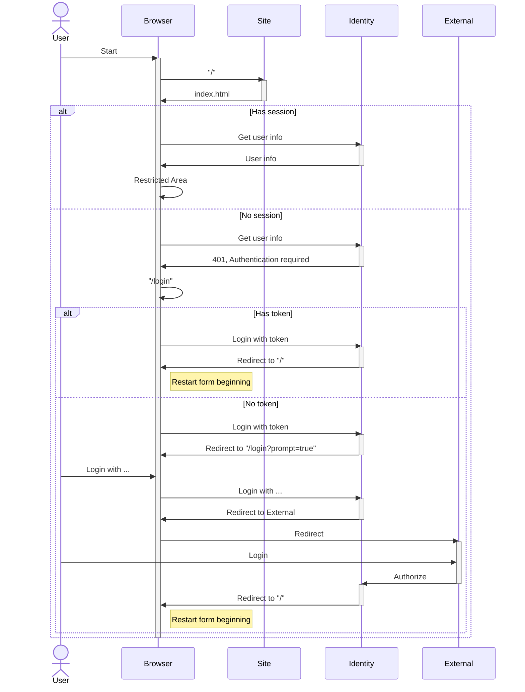

# Login flow

The diagram illustrates the sequence of interactions that occur from the initiation of the website until the user reaches a section with restricted access.

```mermaid
sequenceDiagram
    actor User
    participant Browser
    participant Site
    participant Identity

    User->>Browser: Start
    activate Browser
    Browser->>Site: "/"
    activate Site
    Site->>Browser: index.html
    deactivate Site

    alt Has session
        Browser->>Identity: Get user info
        activate Identity
        Identity->>Browser: User info
        deactivate Identity
        Browser->>Browser: Restricted Area
    else No session
        Browser->>Identity: Get user info
        activate Identity
        Identity->>Browser: 401, Authentication required
        deactivate Identity
        Browser->>Browser: "/login"

        alt Has token
            Browser->>Identity: Login with token
            activate Identity
            Identity->>Browser: Redirect to "/"
            deactivate Identity
            Note right of Browser: Restart form beginning
        else No token
            Browser->>Identity: Login with token
            activate Identity
            Identity->>Browser: Redirect to "/login?prompt=true"
            deactivate Identity
            User->>Browser: Login with ...
            Browser->>Identity: Login with ...
            activate Identity
            #create participant External
            Identity->>Browser: Redirect to External
            deactivate Identity
            Browser->>External: Redirect
            activate External
            User->>External: Login
            External->>Identity: Authorize
            deactivate External
            activate Identity
            Identity->>Browser: Redirect to "/"
            deactivate Identity
            #destroy External
            Note right of Browser: Restart form beginning
        end
    end
    deactivate Browser
```
